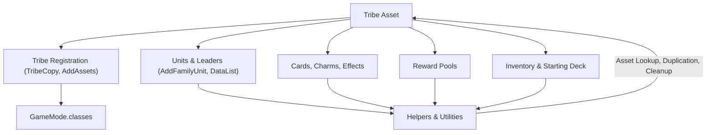
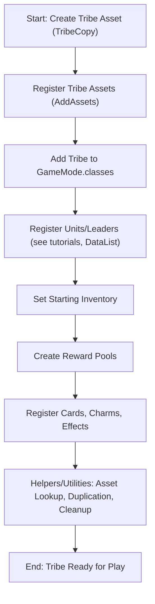

# Tribe Logic Overview

_Last Updated: May 12, 2025_

## Purpose
This document provides a high-level overview of tribe logic in the MadFamily Tribe Mod for Wildfrost. It explains what a tribe is, how tribes interact with other systems (units, cards, charms, effects, inventory, reward pools), and how helpers/utilities support tribe management. For detailed implementation of each subsystem, see the referenced documentation.

---

## Table of Contents
1. [What is a Tribe?](#1-what-is-a-tribe)
2. [Tribe System Components](#2-tribe-system-components)
    - [Component Relationship Diagram](#component-relationship-diagram)
3. [Tribe Logic Flow](#3-tribe-logic-flow)
    - [Tribe Registration Flowchart](#tribe-registration-flowchart)
4. [Interactions with Assembly-CSharp](#4-interactions-with-assembly-csharp)
5. [Best Practices & Rationale](#5-best-practices--rationale)
6. [Quick Reference Table](#6-quick-reference-table)
7. [Advanced Pitfalls & Migration Tips](#7-advanced-pitfalls--migration-tips)
8. [Feedback & Review](#8-feedback--review)
9. [References](#9-references)

---

## 1. What is a Tribe?
A **tribe** in Wildfrost is a collection of units, cards, charms, and effects that share a common theme, mechanics, and progression. Tribes are central to gameplay, determining available leaders, companions, starting inventory, and reward pools.

---

## 2. Tribe System Components

### Component Relationship Diagram
Below is a high-level diagram showing the relationships between the main tribe logic components and helpers:

**Diagram Explanation:**
- The tribe asset is at the center, with registration making it playable.
- Units, inventory, cards/charms/effects, and reward pools are all linked to the tribe and supported by shared helpers/utilities.
- Helpers/utilities provide asset management, duplication, and cleanup for all components.

### 2.2 Units & Leaders
- **Purpose:** Define the playable characters for the tribe.
- **Key Methods:**  
  - Use the approaches described in the official tutorials (see [Tutorial5_CreatingATribe.md](Tutorial5_CreatingATribe.md) and [AddFamilyUnit.md](AddFamilyUnit.md)) for registering units and leaders.
  - `DataList` (helper for batch asset lookup, as described in the tutorials)
- **References:**  
  - [Tutorial5_CreatingATribe.md](Tutorial5_CreatingATribe.md)
  - [AddFamilyUnit.md](AddFamilyUnit.md)

### 2.3 Inventory & Starting Deck
- **Purpose:** Sets up the tribe’s initial cards and upgrades.
- **Key Methods:**  
  - `Inventory` (object holding starting cards/upgrades)
  - `SubscribeToAfterAllBuildEvent` (for post-build customization)
- **References:**  
  - [Tutorial5_CreatingATribe.md](Tutorial5_CreatingATribe.md#starting-inventory)

### 2.4 Cards, Charms, and Effects
- **Purpose:** Cards, charms, and effects define the tribe’s unique mechanics and playstyle.
- **Key Methods:**  
  - `AddCharm`, `AddStatusEffect`, `AddItemCard`, etc.
- **References:**  
  - [Tutorial2_CardsAndStatusEffects.md](Tutorial2_CardsAndStatusEffects.md)
  - [Tutorial3_CharmsAndKeywords.md](Tutorial3_CharmsAndKeywords.md)
  - [ImplementingStatusEffects.md](ImplementingStatusEffects.md)

### 2.5 Reward Pools
- **Purpose:** Control which units, items, and charms are available as rewards for the tribe.
- **Key Methods:**  
  - `CreateRewardPool` (helper for pool creation)
  - `DataList` (for asset lookup)
- **References:**  
  - [Tutorial5_CreatingATribe.md#reward-pools](Tutorial5_CreatingATribe.md#reward-pools)
  - [docs/data/Reward Pools.md](data/Reward%20Pools.md)

### 2.6 Helpers & Utilities
- **Purpose:** Centralize and abstract logic for asset management, data lookup, prefab handling, and code reuse across all tribe-related systems.
- **Key Helpers (from tutorials):**
  - `TribeCopy`: Duplicates a base tribe for safe, modular customization (see tutorials).
  - `DataList`: Batch asset lookup for cards, units, effects, etc. (see tutorials).
  - `RemoveNulls`: Cleans up nulls from arrays/lists after asset removal/unload (see tutorials).
  - `UnloadFromClasses`: Cleans up reward pools and class lists on unload (see tutorials).
  - `TryGet`: Safe asset lookup by name/type (see tutorials).
  - `CardCopy`, `StatusCopy`, `DataCopy`: Clone and customize cards, effects, and data assets (see tutorials).
- **Rationale:**
  - Centralizing helpers ensures all tribe logic is DRY (Don't Repeat Yourself), easy to maintain, and less error-prone.
  - Abstracting asset management and registration allows for rapid iteration and easier onboarding of new contributors.
  - Helpers are documented in [ModdingToolsAndTechniques.md](ModdingToolsAndTechniques.md) and referenced throughout this overview for discoverability.
- **References:**
  - [ModdingToolsAndTechniques.md](ModdingToolsAndTechniques.md)

---

## 3. Tribe Logic Flow

### Tribe Registration Flowchart
The following flowchart illustrates the typical registration and initialization flow for a new tribe:

**Flowchart Explanation:**
- This flow shows the step-by-step process for registering a new tribe, from asset creation to final readiness for gameplay.
- Helpers/utilities are used throughout to ensure modularity and maintainability.

---

## 4. Interactions with Assembly-CSharp
- **Never modify or add files in `Reference/Assembly-CSharp`.**
- All tribe logic and mod features must interact with the base game via publicized APIs, patching (e.g., Harmony), and helpers/utilities.
- **Rationale:**
  - Direct modification of decompiled game code is unsupported, breaks compatibility, and is not maintainable.
  - Patching and helpers provide safe, reversible integration points for tribe selection, reward pools, and other systems.
  - Always prefer extending or patching over replacing base game logic.

---

## 5. Best Practices & Rationale
- **Centralize helpers/utilities:** Avoid duplication, reduce bugs, and make future refactors easier.
- **Modularize tribe logic:** Place each tribe, unit, card, charm, and effect in its own file/folder for clarity and maintainability.
- **Document all helpers/utilities:** Every helper should have a usage example and be referenced in this overview and in [ModdingToolsAndTechniques.md](ModdingToolsAndTechniques.md).
- **Never touch decompiled game code:** Always use mod hooks, patching, and helpers for all integration.
- **Review and refactor regularly:** As helpers/utilities evolve, update documentation and refactor code to match best practices.
- **Discuss and document rationale:** For every migration or refactor, explain why changes were made to help future contributors understand the logic and avoid regressions.

---

## 6. Quick Reference Table
| System         | Key Helpers/Methods                                 | Example Usage/Code Snippet                                                                 | Detailed Docs                        |
|----------------|----------------------------------------------------|-------------------------------------------------------------------------------------------|--------------------------------------|
| Registration   | TribeCopy, AddAssets, GameMode.classes             | `assets.Add(TribeCopy("Basic", "MadFamily"))` `gameMode.classes = ...`                | Tutorial5_CreatingATribe.md          |
| Units/Leaders  | DataList                  | `DataList<CardData>("Alison", "Tony")`                | AddFamilyUnit.md, Tutorial5_CreatingATribe.md                     |
| Inventory      | Inventory, SubscribeToAfterAllBuildEvent           | `inventory.deck.list = DataList<CardData>(...)`                                            | Tutorial5_CreatingATribe.md          |
| Cards/Charms   | AddCharm, AddItemCard        | `AddCharm("PugCharm", ...)` `AddItemCard("SnowPillow", ...)`                          | Tutorial2, Tutorial3, EnhancedCharm  |
| Effects        | AddStatusEffect, AddCopiedStatusEffect | `AddStatusEffect("OnKillHealToSelf", ...)` `AddCopiedStatusEffect(...)`                | ImplementingStatusEffects.md         |
| Reward Pools   | CreateRewardPool, DataList                         | `CreateRewardPool("MadFamilyUnitPool", "Units", DataList<CardData>(...))`                | data/Reward Pools.md                 |
| Utilities      | RemoveNulls, TryGet, UnloadFromClasses   | `RemoveNulls(gameMode.classes)` `TryGet<ClassData>("MadFamily")`    | ModdingToolsAndTechniques.md         |
---

**Note:** Only helpers and patterns from the official tutorials or Assembly-CSharp are currently supported. New helpers will be introduced and documented as the project evolves. If a helper is not documented in the tutorials or Assembly-CSharp, it should not be used or referenced yet.

---

## 6.1 Migration & Refactor Checklist

Use this checklist when migrating, refactoring, or reviewing tribe logic to ensure best practices and maintainability:

**General Migration Checklist:**
- [ ] Review all tribe logic for references to legacy or unsupported helpers. Remove or replace with tutorial/Assembly-CSharp patterns.
- [ ] Ensure all helpers/utilities used are documented in the official tutorials or Assembly-CSharp.
- [ ] Update all code snippets and examples to match current best practices.
- [ ] Validate that all asset registration (units, cards, effects, charms, reward pools) follows the recommended order and uses supported helpers.
- [ ] Check for and remove any direct references to decompiled game code (except via public APIs or patching).
- [ ] Modularize tribe logic: one class/file per tribe, unit, card, charm, or effect where possible.
- [ ] Update documentation to reflect any changes in logic, helpers, or workflow.
- [ ] Run tests or manual checks to confirm tribe registration and gameplay work as expected.

**Advanced Refactor Checklist:**
- [ ] Group all effect registration in a dedicated phase or file to avoid load order issues.
- [ ] Use `RemoveNulls` and `UnloadFromClasses` on unload to clean up asset lists.
- [ ] Scan for duplicate helpers/utilities and consolidate as needed.
- [ ] Ensure all tribe-specific content is scoped to the correct pools and not added globally unless intended.
- [ ] Assign a reviewer to check both code and documentation for consistency and clarity after major changes.

**Documentation & Review Checklist:**
- [ ] Update this overview and all referenced docs after each migration or refactor.
- [ ] Add or update usage examples for every helper in both this overview and [ModdingToolsAndTechniques.md](ModdingToolsAndTechniques.md).
- [ ] Schedule regular documentation reviews and set a "Next Review Date" in this file.

**Next Review Date:** 2025-06-14 _(Set after tribe migration and documentation update)_

---

## 10. MadFamily Tribe Modularization & Registration Example

The MadFamily tribe is implemented in `WildfrostBirthday/Tribes/Tribe_MadFamily.cs` using a modular, best-practices approach:

- **One tribe per file:** All tribe logic is contained in a single static class with a `Register(WildFamilyMod mod)` method.
- **Minimal entry point:** The `Register` method only handles tribe asset creation, leader assignment, starting inventory, and reward pool setup. All helpers/utilities are called from centralized files.
- **Approved helpers only:** Only helpers/utilities documented in [ModdingToolsAndTechniques.md](ModdingToolsAndTechniques.md) and [UtilitiesOverview.md](UtilitiesOverview.md) are used (e.g., `TryGet`, `DataList`, `CreateRewardPool`).
- **Documentation:** The file is fully commented to explain each step, and this overview is updated after each migration/refactor.

**Registration Flow:**
1. Create the tribe asset with `ClassDataBuilder` and set flag, SFX, and ID.
2. Assign leaders (must be registered before tribe).
3. Set up starting inventory and upgrades.
4. Create and assign reward pools using helpers.
5. Add the tribe asset to the mod's asset list for registration.

See the file and comments for a full example. This pattern should be followed for all future tribes.

---

## 7. Advanced Pitfalls & Migration Tips
- **Load order issues:** Register effects before referencing them in units/charms. Use helpers (as described in the tutorials) to ensure correct order. Consider grouping all effect registration in a dedicated phase or file.
- **Null references:** Use `RemoveNulls` and `UnloadFromClasses` on unload to clean up asset lists. Always validate asset lists after migration or refactor.
- **Asset duplication:** Use helpers like `DataList` and `TribeCopy` to avoid duplicating logic or assets. Scan for duplicate helpers/utilities during each migration.
- **Cross-tribe contamination:** Always scope cards, charms, and effects to the correct tribe and pools. Never add tribe-specific content to global pools unless intended.
- **Helper misuse:** Ensure all helpers/utilities are used as intended and are up to date with the latest refactors. Document any custom or overridden helpers.
- **Documentation drift:** After each migration or refactor, update this overview and all referenced docs to match the new structure and logic. Outdated docs are a major source of confusion for new contributors.
- **Modularization patterns:** Prefer one-class-per-file and one-feature-per-folder for all tribe logic. Use index or registration files to aggregate and register tribe content.
- **Review workflow:** After major changes, assign a reviewer to check both code and documentation for consistency and clarity.

---

## 8. Feedback & Review
- Testing plan and validation steps are now tracked in `docs/TestingPlan.md` (added 2025-05-14). All tribe logic and registration should be validated using this plan after each migration or refactor.
- Share this document with collaborators for feedback.
- Revise as tribe logic evolves.

---

## 9. References
- [Tutorial5_CreatingATribe.md](Tutorial5_CreatingATribe.md)
- [AddFamilyUnit.md](AddFamilyUnit.md)
- [ModdingToolsAndTechniques.md](ModdingToolsAndTechniques.md)
- [Tutorial2_CardsAndStatusEffects.md](Tutorial2_CardsAndStatusEffects.md)
- [Tutorial3_CharmsAndKeywords.md](Tutorial3_CharmsAndKeywords.md)
- [ImplementingStatusEffects.md](ImplementingStatusEffects.md)
- [data/Reward Pools.md](data/Reward%20Pools.md)